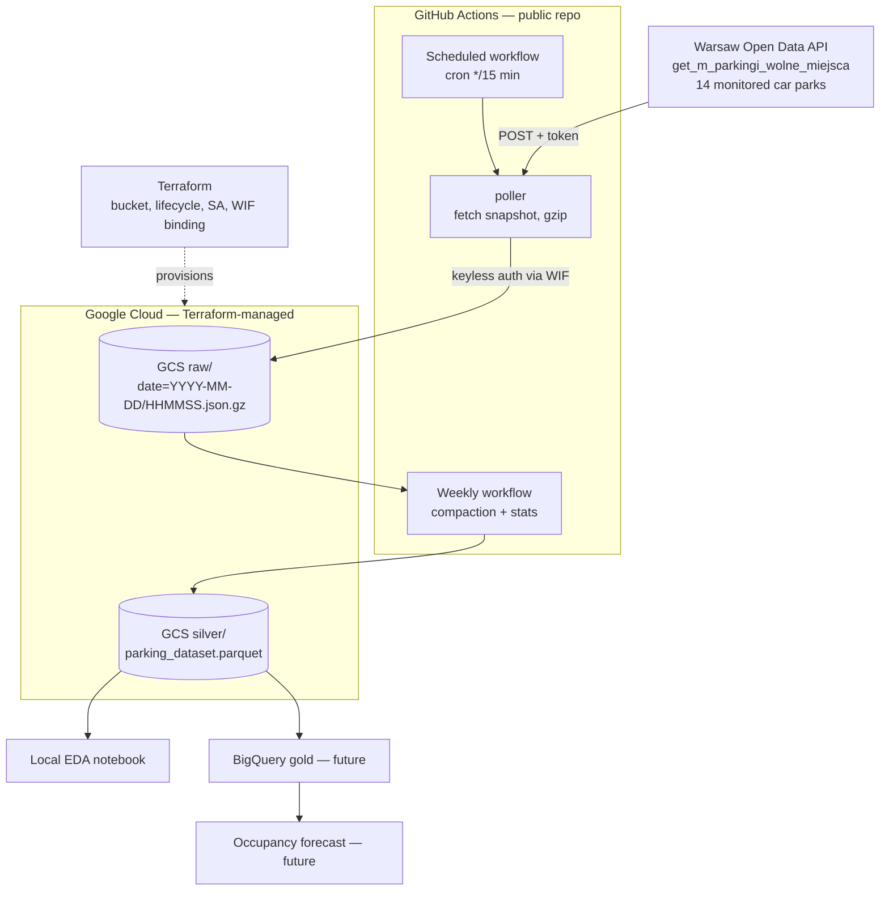

# iva_park — Warsaw parking occupancy dataset

Turning Warsaw's live parking-availability feed into a **historical dataset** for
occupancy forecasting.

The city's open-data API reports only the current state of each car park. It keeps no
history. This project polls that endpoint on a schedule, stores every response as an
immutable timestamped snapshot, and flattens the accumulated snapshots into one
analysis-ready table — so the history the portal doesn't keep gets built here.

> **Status:** postponed while I defended my master's thesis; continuing.
> The collector and the transform work and have produced a dataset. The cloud
> deployment (Phase 1–3 below) is designed but not yet built.

---

## What works today

| Stage | State | Where |
|---|---|---|
| Fetch one snapshot from the API | **working** | `ping/ping_parkings.py` |
| Immutable raw storage with provenance | **working** | `raw_data/<endpoint>/<UTC timestamp>.json` |
| Flatten snapshots into a silver table | **working** | `transform/build_silver.py` |
| Exploratory analysis + map | **working** | `eda/parking_eda.ipynb`, `eda/parking_map.html` |
| Scheduled collection in the cloud | designed | `docs/plan.md` Phase 2 |
| Terraform-provisioned GCS lake | designed | `docs/plan.md` Phase 1 |
| Forecasting model | planned | `docs/plan.md` Phase 4 |

## The dataset

Built from the snapshots collected so far:

| | |
|---|---|
| Rows | **140** — one row per car park per snapshot |
| Columns | **59** |
| Car parks | **14** |
| Distinct snapshots | **10** (from 11 raw files — see dedup below) |
| Collected | 10–15 July 2026 |

Columns cover **live occupancy** (`free_public`, `free_disabled`, `free_electric`),
**capacity** (`total_standard`, `total_disabled`, `total_electric`), **location**
(latitude/longitude, address), **opening hours** per weekday, **tariffs** per vehicle
type and stay length, **vehicle dimension limits**, and operator contact details.

The CSV is written with `utf-8-sig` so Polish characters render correctly in Excel.

### Two details worth knowing

**Snapshots are deduplicated on the source timestamp, not on fetch time.** The API
serves the same reading until it refreshes, so polling faster than the refresh rate
returns duplicates. `build_silver.py` drops duplicates on `(parking_id, source_ts)`,
which is why 11 raw files yield 10 distinct snapshots. This makes collection
**idempotent** — re-running the poller can never corrupt the dataset, and cron drift or
double-fires are absorbed automatically.

**The upstream API misspells `address` as `adress`.** The transform reads the key as
published rather than "correcting" it, and maps it to a clean column name on output.

## Repository layout

```
ping/ping_parkings.py       collector — one API call, one immutable snapshot
transform/build_silver.py   raw JSON snapshots -> flat silver table
eda/parking_eda.ipynb       exploratory analysis
eda/parking_map.html        car parks plotted on a map
docs/architecture.md        target architecture + design rationale
docs/plan.md                phased delivery plan, FinOps analysis, risks
secret.example.json         credential template
```

Collected data and derived tables are **not committed** — they are data, not code.
`raw_data/` and `silver/` are gitignored, as is `secret.json`.

## Running it

```bash
cp secret.example.json secret.json    # then add your dane.um.warszawa.pl API token
pip install requests pandas
python ping/ping_parkings.py          # fetch one snapshot -> raw_data/
python transform/build_silver.py      # rebuild silver/parking_dataset.csv
```

Each snapshot is stored wrapped in an envelope that records where it came from and when
it arrived, so a file is self-describing long after collection:

```json
{
  "endpoint": "get_m_parkingi_wolne_miejsca",
  "ingested_at": "2026-07-15T21:06:09+00:00",
  "payload": { "...": "the API response, unmodified" }
}
```

## Target architecture



Running the collector in GitHub Actions rather than on a laptop is the point: the
dataset grows whether or not anything of mine is switched on.

## Design decisions

1. **Object storage over a database for collection** — a database is a serving layer,
   not a lake. Timestamped objects plus Parquet is the standard shape, and each run
   writing one immutable object makes collection incremental by construction.
2. **GCS over S3** — the S3 free tier is time-limited; GCS gives 5 GB Always Free with
   no expiry, and GitHub→GCP Workload Identity Federation avoids storing service-account
   keys in repository secrets.
3. **Calendar effects as flat features, not a graph** — holidays, weekday and shopping
   events join through a `dim_date` table. No graph database is warranted.
4. **One lifecycle rule instead of a retention scheme** — projected volume is
   ~250 MB–1.6 GB/year against a 5 GB free tier.
5. **Public repository** — required for unlimited Actions minutes, and it makes the
   collection run visible.

Full reasoning, the FinOps breakdown and the risk register are in
[`docs/plan.md`](docs/plan.md) and [`docs/architecture.md`](docs/architecture.md).

## Known limits

- **Cron drift** — GitHub Actions schedules fire late under load and occasionally skip.
  Accepted: dedup on `source_ts` absorbs repeats, and irregular sampling is resampled
  downstream.
- **Scheduled workflows auto-disable** after 60 days without repository activity. The
  weekly stats commit doubles as the keep-alive.
- **Small sample so far** — 10 snapshots over six days is enough to validate the
  pipeline, not to train a model. That is what continuous collection is for.

## Data source and attribution

Dataset: [Parkingi — wolne miejsca](https://dane.um.warszawa.pl/en/catalogue/20ec668b-e5f3-4cbf-aeeb-eb825f3c8731),
Warsaw Open Data portal. Access is via an authenticated API token; polling is one
lightweight request per run.

> Data source: Miasto Stołeczne Warszawa — dane.um.warszawa.pl

The portal's terms permit re-use of published datasets. The city provides no warranty on
accuracy, and downstream consumers must carry their own disclaimer.
