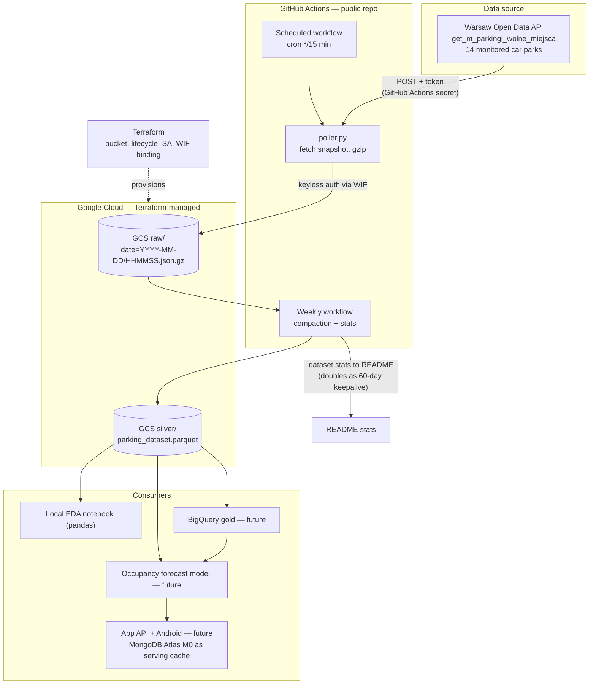

# iva_park — architecture

Automated collection of Warsaw parking availability into a historical dataset
for occupancy forecasting (and, later, an app serving predictions).

## Diagram

## Components

| Component | Role | Why this choice |
|---|---|---|
| GitHub Actions cron | Scheduler (every 15 min) | Free on public repos; no server to keep alive; runs visible publicly (demo value) |
| Python poller | Fetch one snapshot, write immutable gzipped JSON | Each run writes one timestamped object → incremental by construction, idempotent |
| GCS bucket | Data lake (raw + silver) | 5 GB Always Free (no 12-month expiry); object storage matches the medallion pattern |
| WIF (existing) | GitHub→GCP keyless auth | Reuses the Workload Identity Federation already set up; no service-account keys in secrets |
| Terraform | Provisions bucket, lifecycle rule, service account, WIF binding | IaC learning goal; lifecycle rule showcases retention as code |
| Weekly compaction job | Raw JSON → silver parquet + README stats | Compacts small files; commits stats (keeps scheduled workflows from being auto-disabled) |

## Data source, license, purpose

- **Dataset:** [Parkingi — wolne miejsca (Warsaw Open Data)](https://dane.um.warszawa.pl/en/catalogue/20ec668b-e5f3-4cbf-aeeb-eb825f3c8731)
- **Access:** authenticated API (user token), polled every 15 minutes — a single
  lightweight request per run, well within fair use of the portal.
- **Purpose:** the live feed is collected over time **to create a historical
  dataset** for exploratory analysis and training an occupancy-forecasting
  model. The portal exposes only current state; the history is built here.
- **License:** the portal's terms of use permit re-use of published datasets,
  including commercial re-use unless a dataset specifies extra conditions.
  Attribution used everywhere the data appears:
  *"Data source: Miasto Stołeczne Warszawa — dane.um.warszawa.pl"*.
  The city provides no warranty on accuracy; downstream consumers must carry
  their own disclaimer.

## Design decisions (short ADR log)

1. **GCS over MongoDB Atlas for collection** — a database is a serving layer,
   not a lake; object storage + parquet is the standard DE story. Atlas M0
   reserved for the future app cache.
2. **GCS over S3** — S3 5 GB free is time-limited/credit-based; GCS 5 GB is
   Always Free, and GitHub→GCP WIF already exists.
3. **No Neo4j** — calendar/event effects (holidays, Black Friday, weekday) are
   flat features joined via a `dim_date` table, not graph relationships.
4. **No aggressive retention dance** — volume is ~250 MB–1.6 GB/year; a single
   Terraform lifecycle rule is enough for years.
5. **Public repo** — required for unlimited Actions minutes; doubles as the
   interview-ready live demo.
